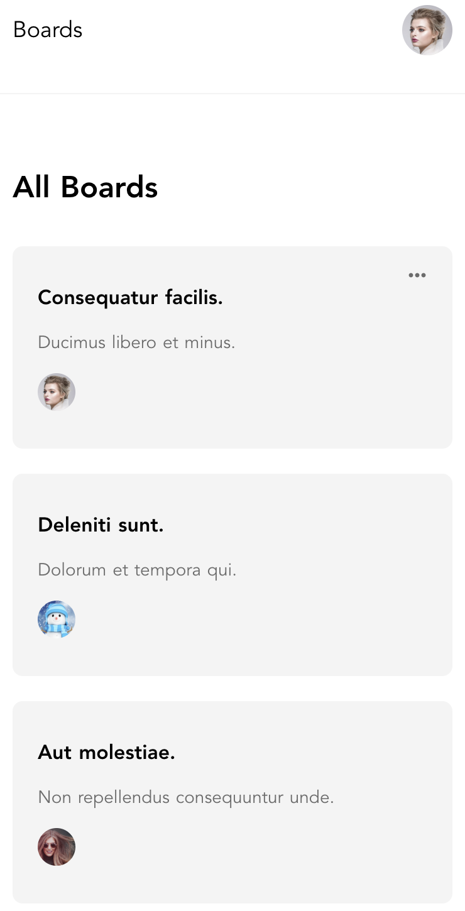
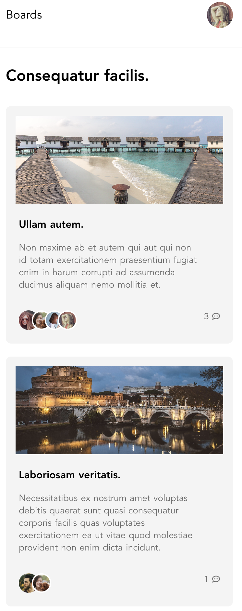
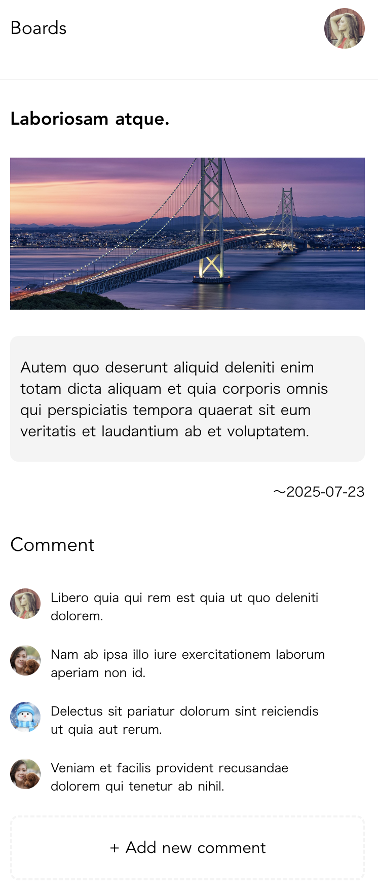
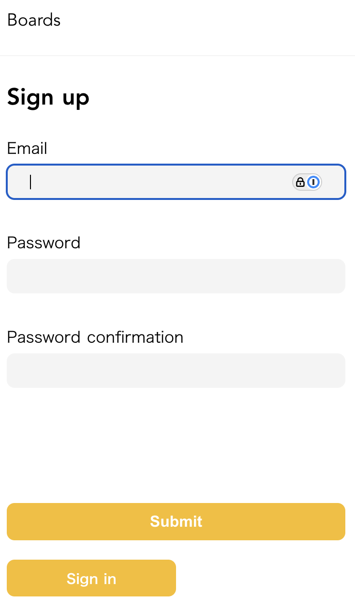
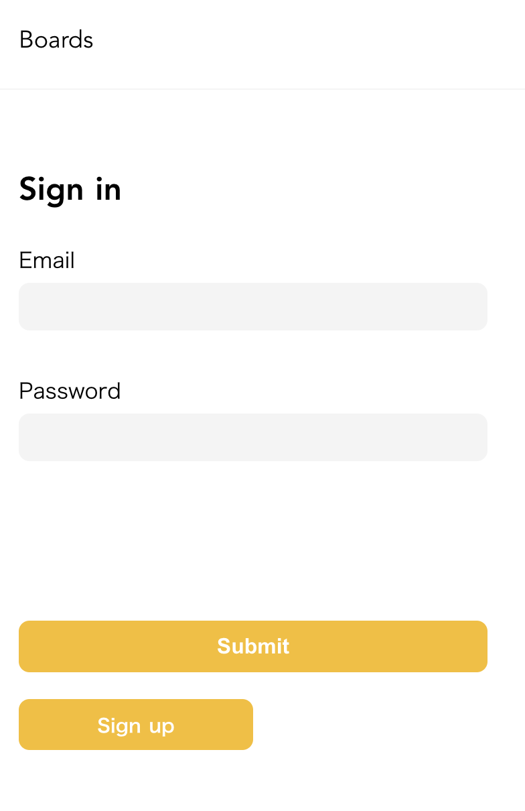
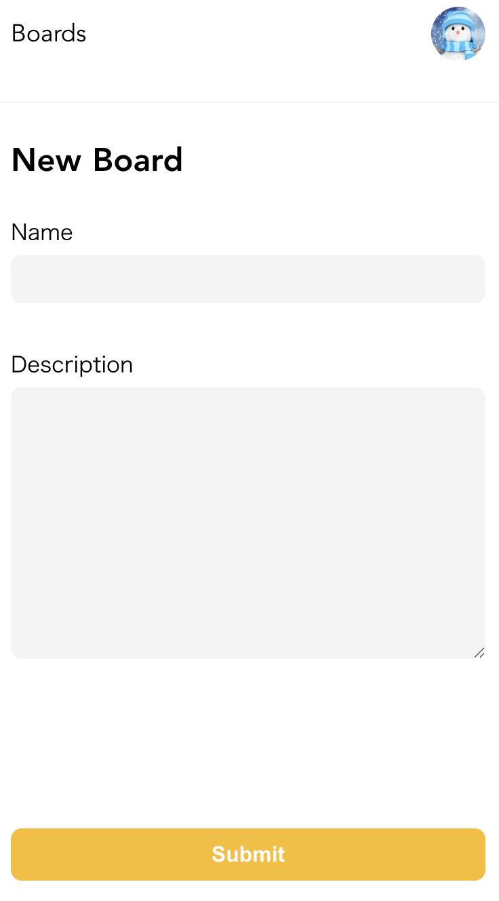
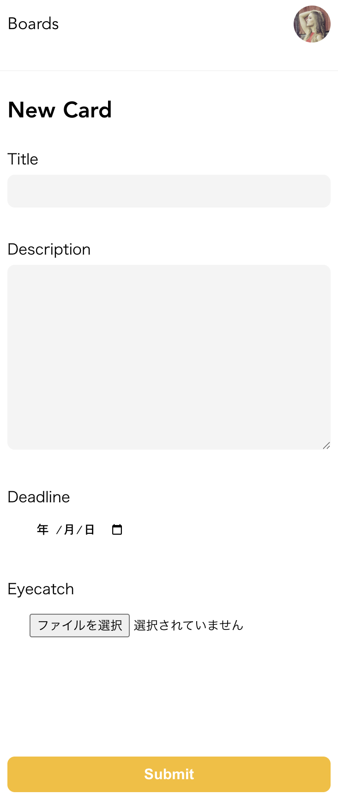
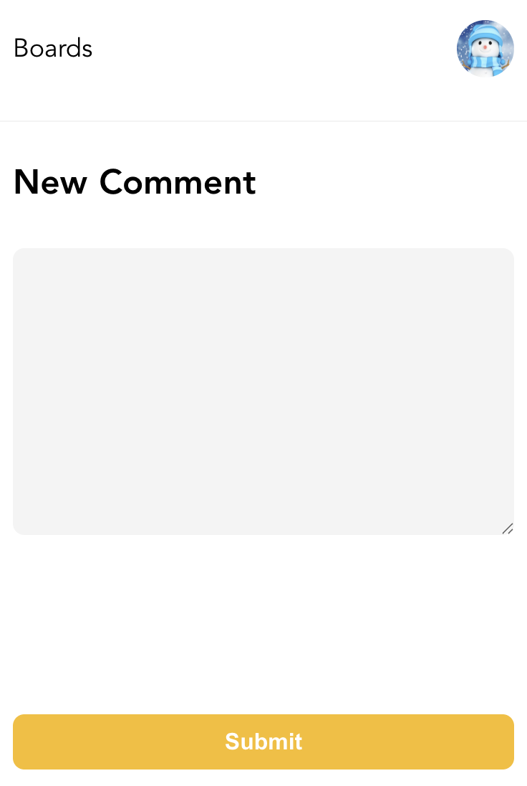

# README

## タイトル

シンプルなTodo管理アプリです。（完成済み）

## 主な機能

- ユーザー登録 / ログイン / ログアウト
- 大枠である記事(ボード) CRUD機能
- ボード内に複数の記事（タスク） CRUD機能
  - タスクには画像・締切の設定が可能 
- 各タスクへのコメント作成・閲覧機能
- ユーザーのアバター設定・変更機能

## 使用技術

- フロントエンド: Haml/SCSS. JavaScript
- バックエンド: ruby(Ruby on Rails). devise
- データベース: PostgreSQL

## 開発背景

このプロジェクトは初学者が学びながら進めているため、時間をかけてじっくり作っています。

## スクリーンショット

### メイン画面

- ログイン後、ボード一覧が表示される。
- ボードをクリックすると、タスク一覧、コメントしているユーザーのアバターも一覧表示される。
- タスク詳細画面では、締切、コメント一覧が表示される。
- アバター未設定の場合、デフォルトのアバターが表示される。 

  
  
  

### ログイン画面

  
  

### 作成画面

- タスク作成画面では、画像の投稿、締切の設定ができる。

  
  
  

