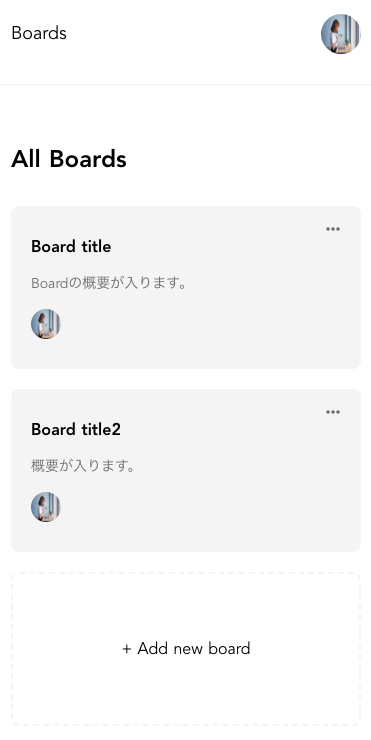
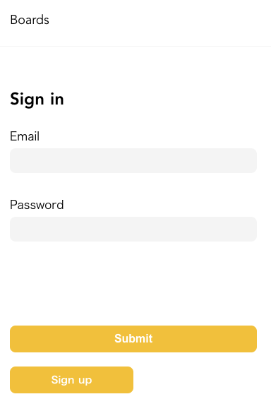
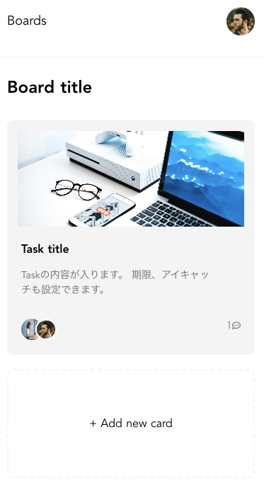
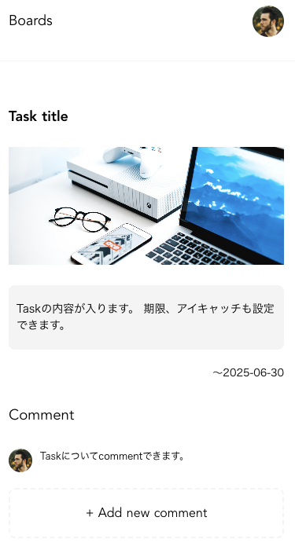

# README

# README

## 現在開発中です。
2025年6月時点、ruby・railsのアップデートに伴うバグを修正中。

## タイトル
シンプルなタスク管理アプリです。
ユーザー登録・ログイン後に、タスクの作成、編集、削除ができます。

## 主な機能
- ユーザー登録 / ログイン / ログアウト
- 記事のCRUD（作成・閲覧・編集・削除）
- 記事のお気に入り登録
- 記事へのコメント機能
- 記事への画像投稿機能（アイキャッチ）

## 使用技術
- フロントエンド:
- バックエンド:ruby
- データベース:

## 開発背景
このプロジェクトは初学者が学びながら進めているため、時間をかけてじっくり作っています。

## スクリーンショット

### メイン画面

### ログイン画面

### board作成画面

### task作成画面

